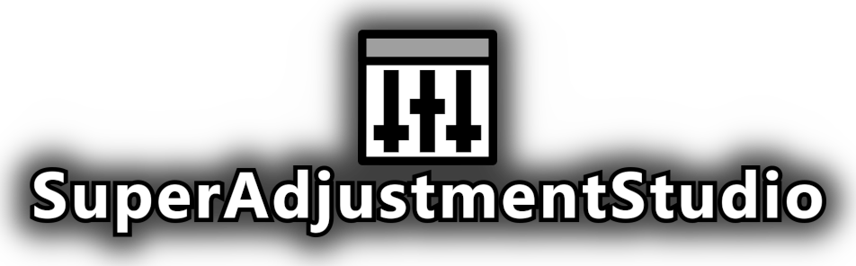

# SuperAdjustmentStudio
<p align="center">
  
</p>

## Overview
**SuperAdjustmentStudio** - **SAS** - is a utility for the modders and virtual photographers to allow the adjustment of a scene, live in game, without the need of LEXplorer. Not everything can be adjusted, but it's enough for the basic manipulation. Currently handling only LE2 with plans to expand to LE1 and LE3.

Please treat this release as <ins>**BETA**</ins>.

### Features (what works)
- transforms for all actors - position, rotation and scale
- playing custom animations - both included in the Pawn's animation set and not
- direct bone posing - you're able to pause current animation and manipulate each single bone on the SkeletalMesh via offsets (trust me, absolute mode is VERY sensitive)
- basic edits of Actor components (for example, you're able to manipulate the brightness of a spotlight!)
- spawning of objects - but only those that engine graciously allows us to
- drawing helpers - orientation gizmo, tracer and a bounding box
- drawing the helpers above everything else (always-on-top)
- click to select for Actors that have a collision
- disabling the collisions for the selected Actor

### Known issues (what doesn't work)
- hiding all game UI - fully borked
- after animation is played back and the character reset - animations stay broken, notably walking animation, which can lead to "sliding" Shepard
- trying to spawn some objects will do nothing, hang the game or crash to desktop, no matter the properties (seems like engine limitation?? or I'm just stupid)
- scaling the bones in non-uniform manner can give weird results (the scale is forced to be uniform by extension)
- some of the components are not editable (for some of them, it's not really possible to make them editable, as we're risking infinite recursion and race conditions)
- not every animation is available to you - if the animation is not loaded anywhere on the scene (via AnimSet or some other way), it's not going to be available. There is a way to dynamically load the packages to the current scene, more research required.

### TODO (what I work on)
- documentation
- translation handling
- improving the search
- handling other properties (Components)
- UI improvements
- UI settings along with customizable keybinds
- saving and loading the presets (saving the poses, the properties for the objects, transforms and so on)
- easier way to spawn a light, an object, a mesh
- spawning a pawn - so you could pose different game characters together!
- expanding to LE1 and LE3 - (LE3 might be easier than LE1)

## Installation
⚠️ **Requires ME3Tweaks ASI loader!** ⚠️

Copy `SAS_SuperAdjustmentStudio.asi` to `ASI` folder in your game's location.

Press `F10` to show the SAS overlay. `Right-click` outside the overlay to move your camera.

## Development
### Prerequisites
- MSVC Visual Studio 18 2026
### Setup
```
git clone <this repo>
git submodule update --init --recursive
```
Copy `env.example.bat` to `env.bat` and set the path inside the file to `ASI` folder in your game's directory.

#### clang diversion
If you're developing via `clangd` and `clangd-format` setup in VSCode:
```
.\compile_commands.bat
```
This will create a new file `compile_commands.json`. VS generator cannot export them for some reason.
### Compiling and deploying
Initially run:
```
cmake -S . -B build -G "Visual Studio 18 2026"
```
To see if it configures properly.

To actually build it, use `build.bat`. It should find `cl.exe` and load apropripate variables by itself. For example:
```
build.bat Release clean
```

To deploy the generated DLL, use `deploy.bat`. It runs `env.bat` and copies the dll as asi to the folder you specified.


## Contributing
```
//TODO: docs/contribute.md
```

## Attributions
This project uses libraries from:
- [llamathings/LExSDKv2](https://github.com/llamathings/LExSDKv2)
- [ocornut/imgui](https://github.com/ocornut/imgui)
- [Rebzzel/kiero](https://github.com/Rebzzel/kiero)
- [TsudaKageyu/minhook](https://github.com/TsudaKageyu/minhook)
- [gabime/spdlog](https://github.com/gabime/spdlog)


Code from:
- [ME3Tweaks/LExASIs](https://github.com/ME3Tweaks/LExASIs)
- [eugen15/directx-present-hook](https://github.com/eugen15/directx-present-hook) 
- [YT: Hooking DirectInput C++](https://www.youtube.com/watch?v=oh9i7hPQZT8)
- MANY more

If I used your code and did not credit you, please reach out, I'll be more than happy to do it.

### Special thanks
- to my friend M., who always listens to my technical yapping
- Mass Effect Modding Discord

## Other things
**I do NOT allow this mod to be reposted just for the translation to be added.** The translation handling will be implemented in the future version, when it does - I'll be more than happy to entertain pull requests with created translations.